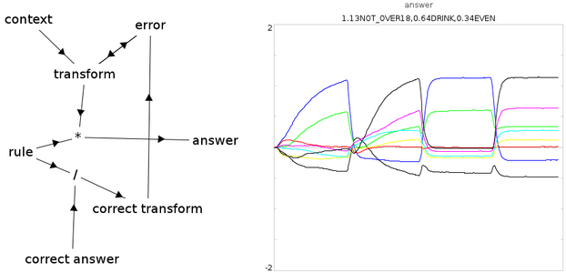

Wason selection task in Nengo
=============================

Two experimental conditions show that the model can learn to process
rules differently depending on context, and that it can generalize to
new rules within a context.

The Wason selection task presents participants with a set of 4 cards
and a rule. Given the rule, participants must choose which cards to
flip over to confirm whether or not the rule is being followed. The
standard result is that people will process a rule in very different
ways, depending on context. For example, with cards showing "A", "B",
"2", and "3" and the rule "If a vowel is on one side of the card, then
the other side must be an even number", most people choose to flip
over the cards "A" and "2". The logically correct choice is to select
"A" and "3". However, if the cards show "age:16", "age:22",
"drink:water", and "drink:beer", while the rule is "If under 18, then
you must drink water" most people correctly choose "age:16" and
"drink:water". Of course, these two conditions are logically
identical.

Our model of this task indicates how this process might be
learned. There are four inputs to the model: the current rule, the
current context, the answer to learn in this context, and a signal to
turn learning on or off. The output is the choice of which cards to
examine.

All values are represented as randomly chosen Semantic Pointers:
high-dimensional vectors that can be compressed together to store
structured information. For example, the rule "If an even number is on
one side of the card, then the other side must be a vowel" is
represented by the vector `ANTE*VOWEL+CONS*EVEN`, where `ANTE`
(antecedent), `VOWEL`, `CONS` (consequent) and `EVEN` are randomly
chosen 128-dimensional unit vectors and `*` is circular
convolution. The answer given by most people would then be
`VOWEL+EVEN`.

The standard explanation of the observed effect is to assume that
people have learned different ways of processing rules in different
contexts. In the "social" context, people have practiced following
rules of this form (perhaps as part of cheater-detection). However,
when presented with what is logically the same rule in an abstract
context, people fall back on a different strategy of simply focusing
attention on the two things that have been highlighted in the rule
itself.

To give a mechanistic account of this process, we need to demonstrate
two things. First, that the model can learn to process the rule in
different ways in different contexts. Second, that the rule processing
can generalize within a context. These are shown by taking the same
model and providing it two different sets of inputs, called
experiment 1 and experiment 2.

For experiment 1, we simply present a single example of the two
different contexts and turn learning on. Then we turn learning off and
confirm that it has learned the correct transformation. In particular,
the inputs are as follows:

- `context=-1`, `rule=ANTE*VOWEL+CONS*EVEN`, `answer=VOWEL+EVEN`,
  learning on for 1.5s
- `context=1`, `rule=ANTE*DRINK+CONS*OVER18`,
  `answer=DRINK+NOT*OVER18`, learning on for 1.5s
- `context=-1`, `rule=ANTE*VOWEL+CONS*EVEN`, learning off for 1.5s
- `context=1`, `rule=ANTE*DRINK+CONS*OVER18`, learning off for 1.5s

The expected result is that in block 3 the model will answer
`VOWEL+EVEN` while in block 4 it will answer `DRINK+NOT*OVER18`.

Experiment 1 merely demonstrates that it can learn specific examples
in specific contexts. However, the whole point of such a system is to
be able to process novel rules in a context-appropriate manner. This
is shown in experiment 2.

- `context=1`, `rule=ANTE*DRINK+CONS*OVER21`,
  `answer=DRINK+NOT*OVER21`, learning on for 1.5s
- `context=1`, `rule=ANTE*VOTE+CONS*OVER18`, `answer=VOTE+NOT*OVER18`,
  learning on for 1.5s
- `context=1`, `rule=ANTE*DRIVE+CONS*OVER16`, learning off for 1.5s

In block 3, the model correctly generalizes and answers
`DRIVE+NOT*OVER16`. Importantly, it does this without ever having seen
that input previously.

See the
[publication](http://compneuro.uwaterloo.ca/files/publications/eliasmith.2005.pdf)
for more details

## Instructions

- Start Nengo 1.4
- Run `wason.py` script
- Go to interactive plots and press play
- To change to experiment 2, change the line `experiment=1` to
  `experiment=2` at the top of the script.
